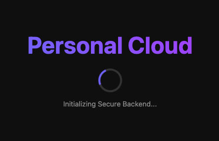

# PersonalCloudApplication



## 1. Overview
A secure, cross-platform desktop application for personal file management.
- **Goal:** Manage files locally and on cloud providers (MVP: Google Drive).
- **Architecture:** Polyglot Clean Architecture (Tauri Rust Core + React UI + Python Logic Sidecar).
- **Security:** Military-grade "Shared Secret" authentication & Dynamic Infrastructure.

## 2. Key Features (Current)
- **Hybrid Architecture:** React Frontend + Python Backend (Sidecar).
- **Zero-Config Startup:** Rust automatically finds a free port (e.g., \`54321\`) so the app never crashes due to port conflicts.
- **Secure Handshake:**
    - **Shared Secret:** Rust generates a random 32-char token at launch.
    - **Access Control:** Python backend rejects any request without \`Authorization: Bearer <TOKEN>\`.
    - **Isolation:** Localhost is protected from external/malware access.
- **Modular Codebase:**
    - **Rust:** Split into State, Commands, and Lib.
    - **Python:** Split into API Routes, Core Config, and Services.
    - **React:** Split into Logic Hooks and UI Components.

## 3. Project Structure

### Rust Core (\`src-tauri/src/\`)
- \`lib.rs\`: Entry point & orchestration.
- \`commands.rs\`: Callable functions exposed to Frontend.
- \`state.rs\`: Shared data structures.

### Python Sidecar (\`python-backend/\`)
- \`main.py\`: Entry point.
- \`api/\`: API Route definitions.
- \`core/\`: Configuration & Security logic.

### Frontend (\`src/\`)
- \`hooks/\`: Application logic (e.g., \`useSidecar.ts\`).
- \`components/\`: Visual elements (e.g., \`Terminal.tsx\`).
- \`api/\`: Typed API Client.

## 4. Roadmap & Status

### Phase 1: Foundation (Completed ✅)
- [x] **Project Skeleton:** Setup Rust, Node, Python environments.
- [x] **Sidecar Integration:** Bundle Python FastAPI as a subprocess.
- [x] **UX Polish:** Native Splash Screen & Real-time Logs.
- [x] **Security:** Token-based authentication & Dynamic Ports.
- [x] **Refactor:** Modular Clean Architecture applied to all 3 languages.

### Phase 2: Authentication (Next 🚧)
- [ ] **Google Cloud Setup:** Create project and get Client ID/Secret.
- [ ] **OAuth Flow:** Python opens system browser for login.
- [ ] **Token Management:** Securely store Access/Refresh tokens.

## 5. Developer Setup

### Prerequisites
- Node.js & npm
- Rust (Cargo)
- Python 3.10+

### Installation
1. **Install Frontend Dependencies:**
   ```bash
   npm install
   ```
2. **Setup Backend:**
   ```bash
   cd python-backend
   python3 -m venv venv
   source venv/bin/activate
   pip install -r requirements.txt
   ```
3. **Setup Rust Dependencies:**
   ```bash
   cd src-tauri
   cargo add rand  # For token generation
   cd ..
   ```

### Build & Run
**Important:** You must rebuild the Python binary whenever you change **any** Python file.

```bash
# 1. Build Sidecar
cd python-backend
# (Activate venv first)
pyinstaller --clean --onefile --name api main.py
mv dist/api ../src-tauri/bin/api-aarch64-apple-darwin 
# (Note: Use your specific architecture suffix, e.g., api-x86_64-pc-windows-msvc.exe)

# 2. Run App
cd ..
npm run tauri dev
```

## 6. Security Architecture
- **Why Dynamic Ports?** Hardcoded ports (8000) cause crashes if other apps use them. We let the OS assign a free port.
- **Why Shared Secret?** Prevents other processes on the user's machine from hijacking the backend port.