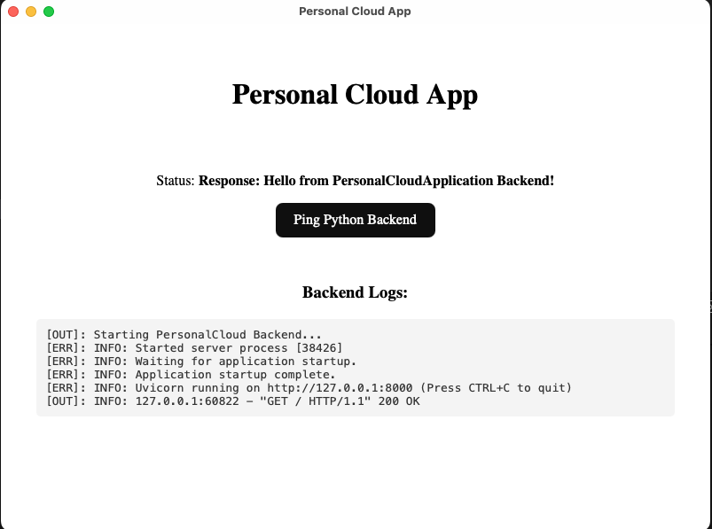

# PersonalCloudApplication

## 1. Overview
A cross-platform desktop application for personal file management.
- **Goal:** Manage files locally and on cloud providers (MVP: Google Drive).
- **Current Status:** MVP Phase (Hello World + Python Sidecar running).

## 2. Architecture
- **Frontend:** React + TypeScript (User Interface)
- **Core:** Tauri v2 (Windowing & System Security)
- **Backend:** Python FastAPI (Bundled Sidecar for Logic/API)

## 3. Developer Setup

### Prerequisites
- Node.js & npm
- Rust (Cargo)
- Python 3.10+

### Installation
1. **Install Frontend Dependencies:**
   \`\`\`bash
   npm install
   \`\`\`
2. **Setup Backend:**
   \`\`\`bash
   cd python-backend
   python3 -m venv venv
   source venv/bin/activate
   pip install -r requirements.txt
   \`\`\`

### Running the App
1. **Build the Sidecar (REQUIRED):**
   You must compile the Python backend before running the app.
   \`\`\`bash
   # In python-backend/
   pyinstaller --clean --onefile --name api main.py
   mv dist/api ../src-tauri/bin/api-aarch64-apple-darwin
   # (Adjust suffix for your OS)
   \`\`\`

2. **Run Tauri:**
   \`\`\`bash
   npm run tauri dev
   \`\`\`

## 4. Troubleshooting
- **"Waiting for backend...":** The Python binary might not be executable. Run \`chmod +x src-tauri/bin/*\`.
- **"Address already in use":** An old version of the backend is still running. Run \`killall api\`.