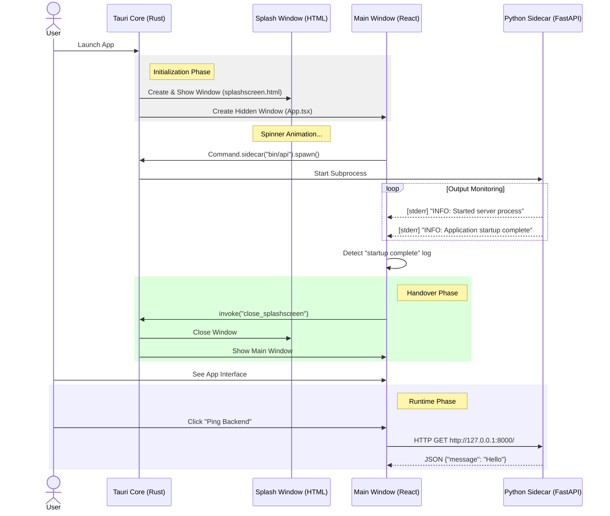

# System Architecture

## 1. High-Level Design
PersonalCloudApplication follows a **Hybrid Desktop Architecture**.
- **Core:** Tauri (Rust) manages the application lifecycle, windows, and system security.
- **UI:** React (TypeScript) runs in a webview to provide the user interface.
- **Logic:** Python (FastAPI) runs as a **Sidecar** (subprocess) to handle business logic, file operations, and OAuth.

## 2. The Sidecar Pattern
Instead of compiling Python into the main binary, we bundle it as a standalone executable.
- **Communication:** The Frontend talks to the Backend via HTTP (REST API) over `localhost`.
- **Security:** The Sidecar is only accessible from `127.0.0.1`.
- **Lifecycle:** The Sidecar is spawned by the React app on launch and killed by Tauri when the app closes.

## 3. Initialization Flow (Splash Screen)
To mask the Python startup time (approx. 1-2s), we use a multi-window strategy.

### Startup Sequence Diagram`

## 4. Key Components

### A. Tauri Core (`src-tauri`)
- **`lib.rs`**: Registers the `shell` plugin and the `close_splashscreen` command.
- **`capabilities/default.json`**: Grants permission to spawn the `bin/api` sidecar.
- **`tauri.conf.json`**: Configures the two windows (`main` hidden, `splashscreen` visible).

### B. Python Sidecar (`python-backend`)
- **`main.py`**: The FastAPI entry point.
- **Requirements:**
    - Must use `CORSMiddleware` to allow requests from the Tauri origin.
    - Must use `print(..., flush=True)` to ensure logs reach React instantly.

### C. Frontend (`src`)
- **`App.tsx`**: Orchestrates the startup. It spawns the sidecar, listens for the "Ready" signal, and triggers the window swap.