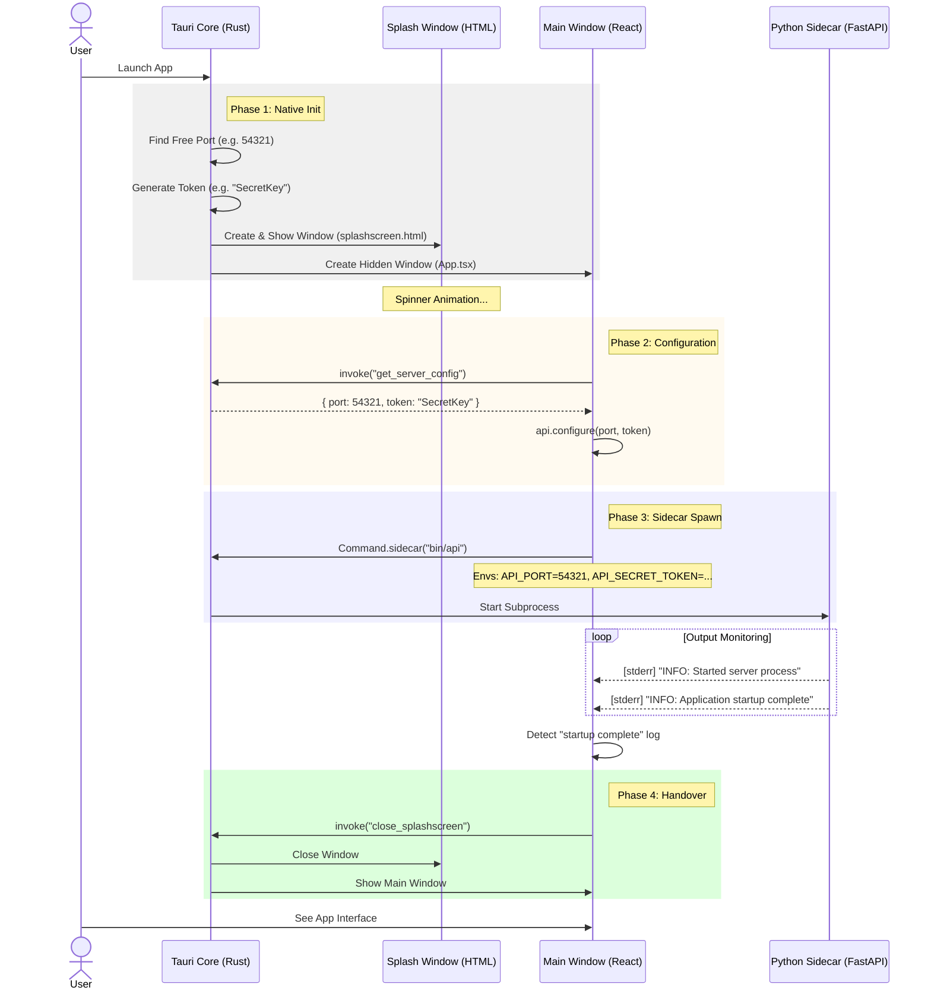
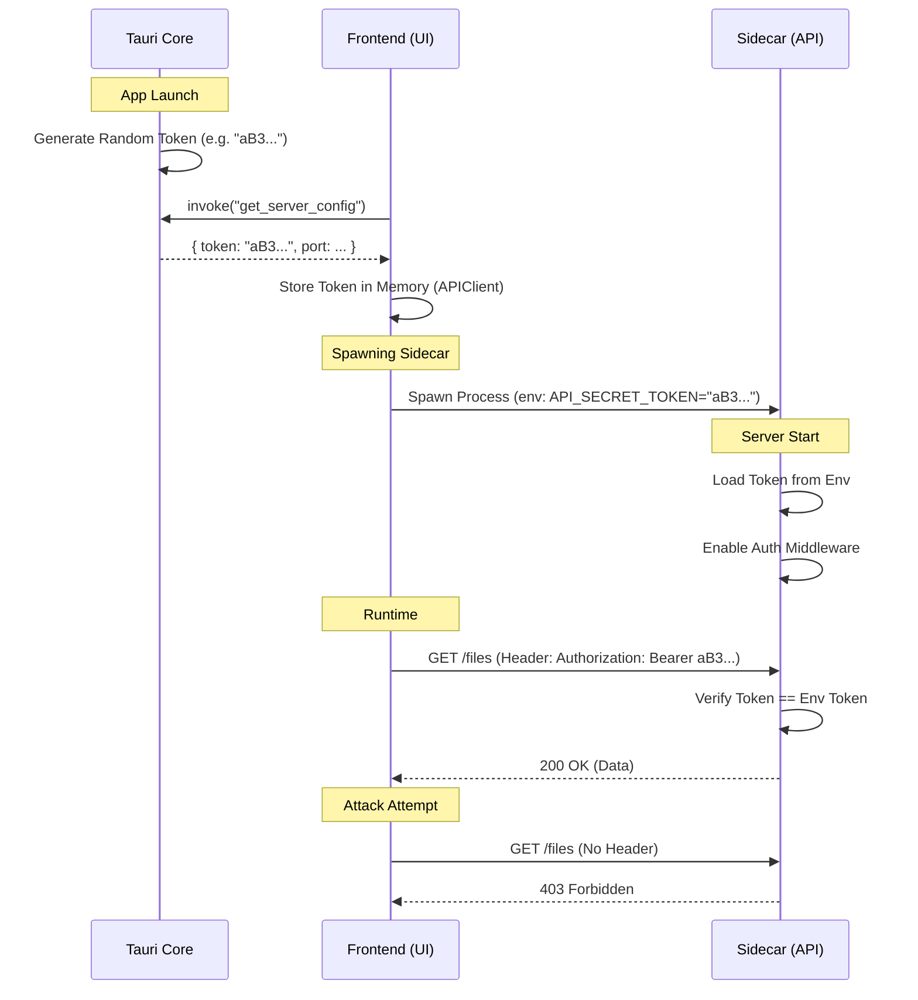

cat <<EOF > docs/design/architecture.md
# System Architecture

## 1. High-Level Design
PersonalCloudApplication follows a **Polyglot Clean Architecture**.
- **Core:** Tauri (Rust) manages the application lifecycle, windows, and system security.
- **UI:** React (TypeScript) runs in a webview to provide the user interface.
- **Logic:** Python (FastAPI) runs as a **Sidecar** (subprocess) to handle business logic, file operations, and OAuth.

## 2. Component Structure (Modular Architecture)

### A. Rust Core (\`src-tauri/src/\`)
We avoid a monolithic \`lib.rs\` by separating concerns:
- **\`lib.rs\`**: The "Main" entry point. Initializes config, finds free ports, builds the app.
- **\`commands.rs\`**: Callable functions from the Frontend (e.g., \`get_server_config\`, \`close_splashscreen\`).
- **\`state.rs\`**: Data structures (Mutex, Config structs) shared across threads.

### B. Python Sidecar (\`python-backend/\`)
Follows a standard FastAPI Service Layer pattern:
- **\`main.py\`**: Entry point. Wires middleware and routes.
- **\`api/\`**: Endpoint definitions (Routes).
- **\`core/\`**: Configuration (\`config.py\`) and Security (\`security.py\`).
- **\`services/\`**: Business logic (e.g., Google Drive API wrapper).

### C. Frontend (\`src/\`)
Separates Application Logic from View:
- **\`hooks/\`**: Custom hooks (e.g., \`useSidecar.ts\`) containing the startup logic and event listeners.
- **\`components/\`**: "Dumb" UI elements (e.g., \`Terminal.tsx\`, \`Dashboard.tsx\`).
- **\`api/\`**: Data Access Layer (\`client.ts\`) handling the Typed API and Auth headers.

## 3. Initialization Flow (Splash Screen)
To mask the Python startup time (approx. 1-2s), we use a multi-window strategy combined with a dynamic configuration handshake.

### Startup Sequence Diagram

## 4. Technology Rationale (The "Triple Stack")

Our architecture is "Polyglot," meaning it uses specific languages for specific domains to maximize performance and developer productivity.

### A. Rust (Tauri Core) - The "Body"
- **Role:** Operating System (OS) Interface & Security.
- **Why:** Rust is memory-safe and has a tiny footprint. It handles window creation, file system permissions, and spawning the sidecar securely.

### B. React (Frontend) - The "Face"
- **Role:** User Interface (UI).
- **Why:** React is the industry standard for interactive UIs. It offers the richest ecosystem of component libraries (charts, grids, animations).

### C. Python (Sidecar) - The "Brain"
- **Role:** Business Logic & Integrations.
- **Why:** Python has the world's best libraries for Data Science, AI, and Cloud APIs (Google Drive).
- **Justification:** Writing complex Google API OAuth logic or image processing in Rust is difficult. In Python, it is effortless.

## 5. Security Architecture (The "Secure Handshake")

To prevent unauthorized access to the local backend (e.g., from malicious browser extensions or malware), we implement a **Shared Secret Authentication** protocol.

### The Problem
By default, \`localhost\` ports are open to any process on the machine. A malicious script could theoretically send commands to delete files if it guessed the port.

### The Solution: Ephemeral Bearer Tokens
We use a "Defense in Depth" strategy where the Rust Core acts as the Source of Truth for security.

### Protocol Flow
1.  **Generation:** On app launch, Rust generates a cryptographically secure random 32-char string (\`API_SECRET_TOKEN\`).
2.  **Injection:** React asks Rust for this token via \`invoke('get_server_config')\`.
3.  **Spawn:** React spawns the Python Sidecar, passing the token as a **private environment variable**.
4.  **Enforcement:** Python's FastAPI middleware rejects *any* request that does not include the header \`Authorization: Bearer <TOKEN>\`.

### Security Sequence Diagram

## 6. Dynamic Infrastructure (Port & Security)

To ensure reliability across different environments, the application uses **Dynamic Port Allocation** instead of hardcoded ports.

### The Problem
- Hardcoding \`localhost:8000\` fails if the port is already in use by another application.
- Managing secrets and ports separately in 3 languages is error-prone.

### The Solution: Rust as "Source of Truth"
Rust (Tauri Core) is responsible for defining the infrastructure configuration at runtime.

### Orchestration Flow
1.  **Rust Startup:**
    - Binds to Port 0 (OS assigns a random free port, e.g., \`54321\`).
    - Generates a random 32-char \`API_SECRET_TOKEN\`.
    - Stores \`{ port, token }\` in the global AppState.

2.  **Frontend Config:**
    - React invokes \`get_server_config\`.
    - Rust returns the JSON object: \`{ "port": 54321, "token": "xyz..." }\`.
    - React configures the API Client with the base URL \`http://127.0.0.1:54321\`.

3.  **Backend Config:**
    - React spawns the Python Sidecar using \`Command.sidecar\`.
    - Injects Environment Variables: \`API_PORT=54321\` and \`API_SECRET_TOKEN=xyz...\`.
    - Python starts Uvicorn on the specified port.